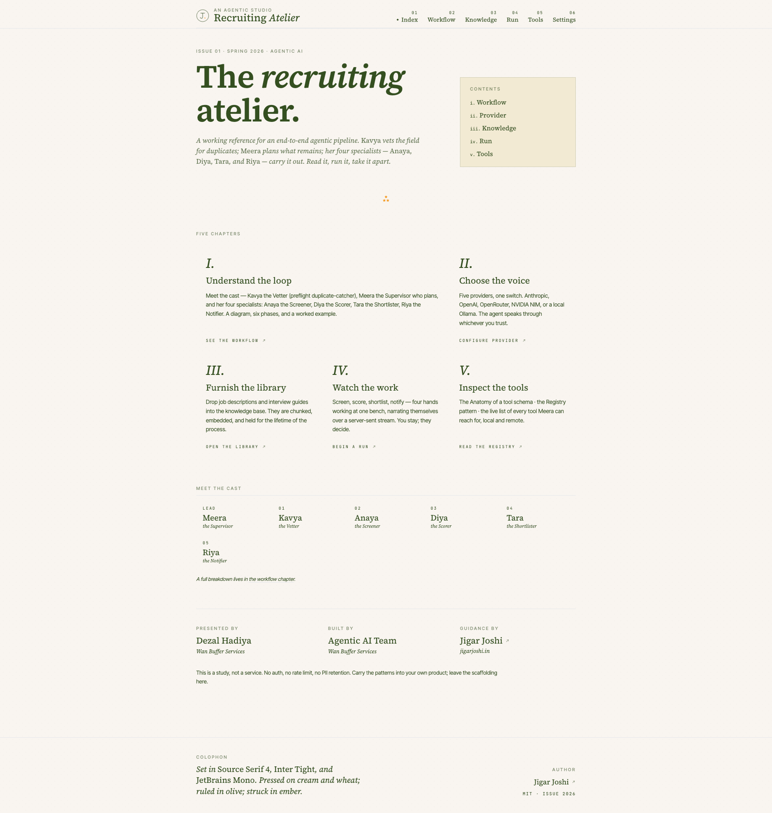
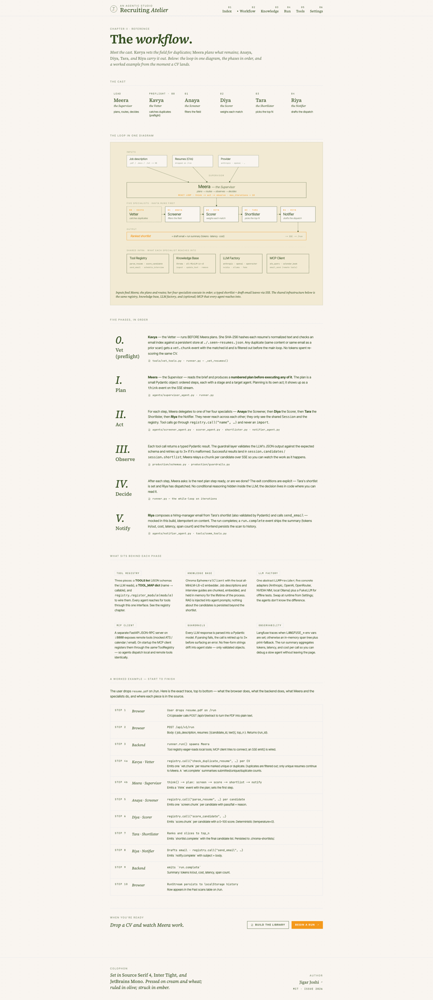
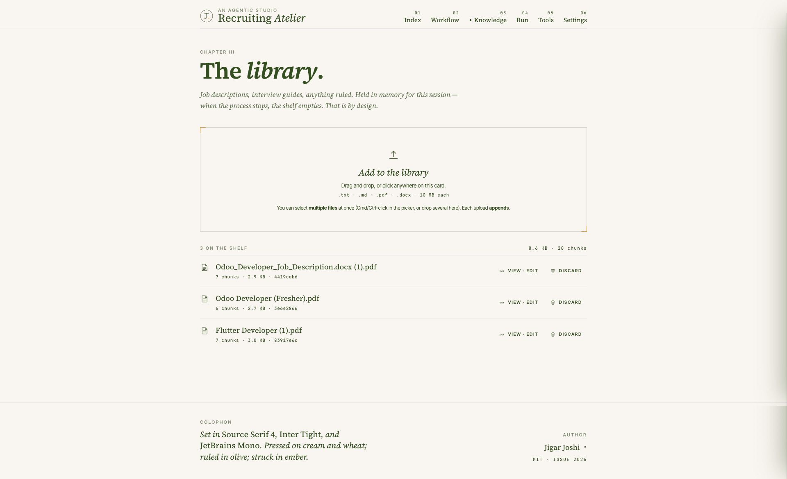
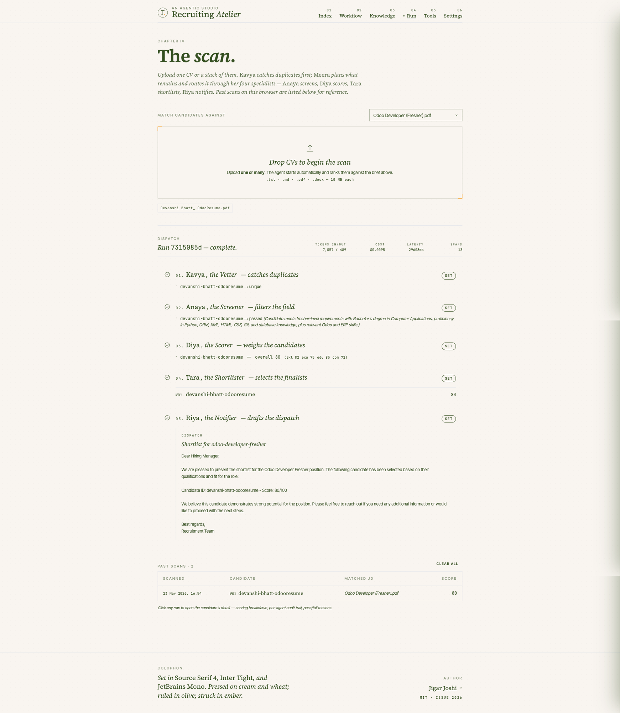
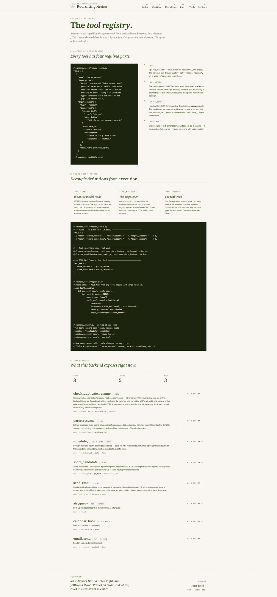
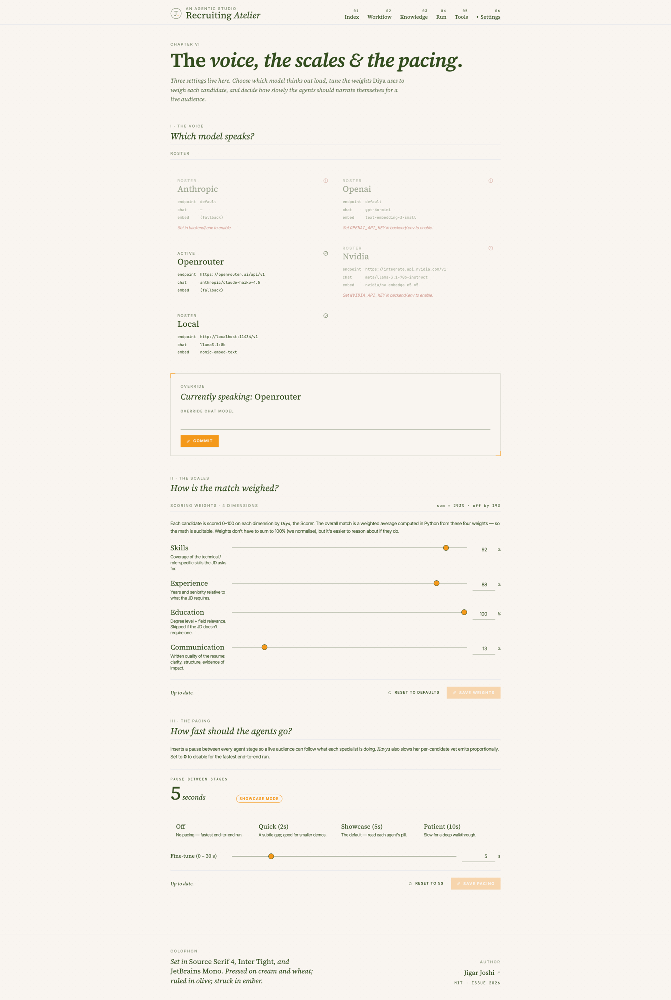

# Recruiting Atelier

An open, end-to-end **Agentic AI reference application** that screens resumes, scores candidates, shortlists the best fits, and notifies the hiring manager — autonomously. Built as a learning resource for engineers who want to understand how production-shaped agentic systems are wired together, with every concept (planning, multi-agent, RAG, MCP, tool registry, memory, observability, guardrails) implemented in real, runnable code — and presented through an editorial, magazine-style UI rather than a generic SaaS dashboard.

> **Author**: [Jigar Joshi](https://jigarjoshi.in)
> **Status**: Working reference implementation — see [§ Production readiness](#production-readiness) before using with real candidate data.

---

## Screenshots

### `/` — Index

<p align="center">
  
</p>
<p align="center"><em>Issue 01 cover: italic Source Serif 4 headline, the five chapters, and the full cast (Meera + Kavya + Anaya + Diya + Tara + Riya).</em></p>

### `/workflow` — Workflow

<p align="center">
  
</p>
<p align="center"><em>The cast strip, the loop in one inline-SVG diagram, the six phases (preflight Vet + Plan / Act / Observe / Decide / Notify), the supporting infra, and a ten-step worked example from CV-drop to history row.</em></p>

### `/kb` — Knowledge

<p align="center">
  
</p>
<p align="center"><em>Drop multiple <code>.txt / .md / .pdf / .docx</code> files at once. Each row offers a hairline View · Edit (right-side TipTap drawer) and Discard.</em></p>

### `/run` — The scan

<p align="center">
  
</p>
<p align="center"><em>Drop a CV, the pipeline starts: Kavya vets, Anaya screens, Diya scores with the per-dimension breakdown, Tara shortlists, Riya drafts the dispatch. Past scans accumulate below — click any row to open the candidate-detail drawer.</em></p>

### `/tools` — The tool registry

<p align="center">
  
</p>
<p align="center"><em>Anatomy of a tool schema (using our real <code>parse_resume</code>), the <code>TOOLS list / TOOL_MAP / Tool function</code> pattern, and the live registry with every local + MCP tool and its full JSON Schema on demand.</em></p>

### `/settings` — Voice, scales &amp; pacing

<p align="center">
  
</p>
<p align="center"><em>Three sections: <strong>I · The voice</strong> (five-provider grid with override), <strong>II · The scales</strong> (the four weight sliders Diya uses), <strong>III · The pacing</strong> (0–30 s demo delay with Off / Quick / Showcase / Patient presets).</em></p>

---

## What it does

Build a knowledge base from job descriptions and interview guides, drop one or many CVs onto the run page, and a cast of named specialists takes over: **Kavya** catches duplicates, **Meera** plans the work, then **Anaya → Diya → Tara → Riya** screen, score, shortlist, and notify — streaming every step to your browser over Server-Sent Events. Past scans are remembered per browser; click any candidate to see the full audit trail in a right-side drawer.

The full flow from CV upload to ranked shortlist is autonomous — no human in the loop. The interface is intentionally not autonomous: the user controls the brief, the library, and the moment of dispatch.

---

## Meet the cast

| # | Agent | Role | What they do |
|---|---|---|---|
| LEAD | **Meera** | Supervisor | Plans the work, routes to specialists, decides when to stop |
| 00 | **Kavya** | Vetter (preflight) | SHA-256 hashes each resume + checks an email index; filters duplicates before the main loop |
| 01 | **Anaya** | Screener | Pass / fail against the JD's must-haves |
| 02 | **Diya** | Scorer | 0–100 on **four dimensions** (skills · experience · education · communication), with a Python-side weighted overall |
| 03 | **Tara** | Shortlister | Ranks the candidates that passed; picks the top N |
| 04 | **Riya** | Notifier | Drafts and sends the hiring-manager email (mocked) |

A full breakdown — diagram, phase-by-phase, worked example — lives at [`/workflow`](#chapter-structure).

---

## Highlights of this edition

- **Editorial UI** — Cream/wheat/olive/ember palette, Source Serif 4 + Inter Tight + JetBrains Mono. Every glyph is a hand-drawn inline SVG (no Lucide, no Material Icons, no generic component library). Designed to look like a thoughtful publication's admin tool.
- **Upload-and-go scan** — Drop a CV (or many) onto the run page; the pipeline starts the moment files land. Past scans land in a ranked table below; **click any row** to open a candidate-detail drawer with the full chart + per-agent audit trail.
- **Duplicate detection by Kavya** — Persistent hash + email store at `./.seen-resumes.json` catches the same CV uploaded twice (within a run or across runs); the rest of the pipeline never wastes tokens re-scoring it.
- **Multi-dimensional scoring you can tune** — Diya scores four independent dimensions; you set the weights from `/settings`. The overall is computed in Python so the math is auditable.
- **Demo pacing** — A single knob in `/settings` inserts a 0–30 s pause between agent stages so a live audience can follow each Awaiting → In hand → Set transition. Default is 5 s (showcase mode).
- **Knowledge-base prerequisite** — The run page is gated: until at least one job description is in the library, the upload zone is replaced with a prompt sending you to `/kb`.
- **Rich-text KB editor** — Click any KB document and a right-side drawer slides in with a TipTap WYSIWYG editor (bold/italic/underline/strike, H1–H3, lists, blockquote, code block, undo/redo). Saving re-chunks and re-embeds while preserving the doc id.
- **PDF + DOCX everywhere** — Both the KB uploader and the CV uploader accept `.txt / .md / .pdf / .docx`. Server-side extraction via `pypdf` and `python-docx`, with a reflow step that repairs the one-fragment-per-line output some PDFs produce.
- **Tool registry chapter** — A dedicated `/tools` page that teaches the **TOOLS list / TOOL_MAP dict / Tool function** pattern using this repo's own code, and lists every registered tool (local + MCP) with full JSON Schema on demand.

---

## Key features

| Category | What you get |
|---|---|
| **Multi-agent pipeline** | Supervisor (Meera) + preflight Vetter (Kavya) + four specialist workers (Anaya, Diya, Tara, Riya) with shared session state |
| **Planning agent** | Meera produces a numbered step plan *before* executing any of it |
| **Duplicate detection** | Kavya hashes resume content + indexes emails; flags duplicates across runs (persistent JSON store) so the LLM never re-scores the same CV |
| **Tunable multi-dimensional scoring** | Four independent 0–100 scores (skills · experience · education · communication) with a Python-computed weighted overall; weights live in `/settings` |
| **Tool registry** | Hand-written JSON Schema per tool · explicit `TOOL_MAP` dispatch · `register_module()` walks both. Local + MCP tools share one interface |
| **Retrieval-Augmented Generation** | Drag-drop upload of JDs and guides; chunks embedded and retrieved into agent prompts |
| **Knowledge base CRUD** | List · view · **rich-text edit** (TipTap) · delete. Doc id preserved across edits |
| **Candidate detail drawer** | Click any past-scan row to see the full audit trail: bar chart of the 4-dim breakdown + per-agent decisions (pass/fail/skipped) + Diya's justification + run context table |
| **Demo pacing** | 0–30 s configurable pause between agent stages, so a live audience can follow each Awaiting → In hand → Set transition |
| **Memory layers** | Short-term `Session` dataclass per run; long-term Chroma-backed shortlist history on disk; browser-local scan history; persistent dedup store for Kavya |
| **Model Context Protocol (MCP)** | Separate FastAPI JSON-RPC server exposes ATS/calendar/email mocks; client auto-registers them through the same registry |
| **Multi-provider LLM** | Swap between **Anthropic, OpenAI, OpenRouter, NVIDIA NIM, and local (Ollama)** at runtime |
| **Editorial web UI** | Next.js 14 (App Router), Source Serif 4 + Inter Tight + JetBrains Mono, hand-drawn SVG marks, right-side drawers, asterism dividers |
| **Observability** | Langfuse tracing with print-fallback; per-run summary with token + latency + cost aggregation |
| **Guardrails** | Every LLM call validates output against a Pydantic schema and retries up to 3× |
| **Typed boundaries** | Pydantic models at every agent and HTTP boundary; `zod` mirrors them client-side |

---

## Architecture at a glance

```
              Next.js 14  (App Router, TypeScript, Tailwind, TipTap, SSE)
              ┌──────────────────────────────────────────────────────┐
              │  /  /kb  /run  /tools  /settings  /shortlist/[jobId] │
              └───────────────────────┬──────────────────────────────┘
                                      │  REST  +  SSE
                                      ▼
                FastAPI HTTP API  (api/v1/*)                  :8011
                                      │
                                      ▼
                ReAct loop  (runner.py)   ───►   Supervisor (planner + router)
                                                  │
                            ┌──────────┬──────────┼──────────┬──────────┐
                            ▼          ▼          ▼          ▼          ▼
                        Screener    Scorer   Shortlister  Notifier    (D7)
                                      │
            ┌─────────────────────────┼──────────────────────────────┐
            ▼                         ▼                              ▼
      Tool Registry             In-memory KB                    MCP Client
      (D3 singleton)            (D6 Chroma                ────────────────►
      • TOOLS list               EphemeralClient)              MCP Server  :8000
      • TOOL_MAP dict            • chunk · embed · ingest      (FastAPI JSON-RPC)
      • register_module()        • update_text() preserves id
```

A full design document with per-file pseudocode, sequence diagrams, and a phased implementation roadmap lives at [`doc/HR_Recruitment_Agent_Plan.md`](doc/HR_Recruitment_Agent_Plan.md).

---

## Tech stack

**Backend** — Python 3.11+
`fastapi` · `uvicorn` · `pydantic` · `chromadb` · `anthropic` · `openai` · `langfuse` · `httpx` · `pypdf` · `python-docx`

**Frontend** — Node 20+
`next` 14 · `react` 18 · `typescript` · `tailwindcss` · `zod` · `@tanstack/react-query`
`@tiptap/react` · `@tiptap/starter-kit` · `@tiptap/extension-underline` · `@tiptap/extension-placeholder`
Fonts: **Source Serif 4**, **Inter Tight**, **JetBrains Mono** (loaded via `next/font/google`)

**LLM providers (any one is enough to run)**

| Provider | SDK | Default chat model | Embeddings |
|---|---|---|---|
| Anthropic | `anthropic` | `claude-sonnet-4-5` | falls back to OpenAI |
| OpenAI | `openai` | `gpt-4o-mini` | `text-embedding-3-small` |
| OpenRouter | `openai` | `anthropic/claude-3.5-sonnet` | falls back to OpenAI |
| NVIDIA NIM | `openai` | `meta/llama-3.1-70b-instruct` | `nvidia/nv-embedqa-e5-v5` |
| Local (Ollama) | `openai` | `llama3.1:8b` | `nomic-embed-text` |

---

## Quick start

```bash
# 1. Clone
git clone <this-repo> recruiting-atelier && cd recruiting-atelier

# 2. Install everything (Python venv + npm)
make install

# 3. Configure — fill in at least one provider API key
cp backend/.env.example backend/.env
$EDITOR backend/.env

# 4. Run all three services together
make dev
```

Open <http://localhost:3000>.

`make dev` starts the **API on `:8011`**, the **MCP server on `:8000`**, and the **Next.js dev server on `:3000`** in parallel. If port `3000` is already taken by another project, start the frontend with `PORT=3001 npm run dev` (in `frontend/`) and update `FRONTEND_ORIGIN` in `backend/.env` to match — CORS uses an explicit allowlist.

---

## Manual setup (three terminals)

Use this if you prefer per-service control over `make dev`.

```bash
# Terminal 1 — HTTP API
cd backend && source .venv/bin/activate
uvicorn api.app:create_app --factory --reload --port 8011

# Terminal 2 — MCP server (separate process by design)
cd backend && source .venv/bin/activate
python -m mcp.server

# Terminal 3 — Next.js frontend
cd frontend && npm run dev
```

---

## Configuration

All backend config lives in `backend/.env` (copy from `.env.example`). Frontend config is in `frontend/.env.local` (copy from `.env.example`).

| Variable | Purpose |
|---|---|
| `LLM_CHAT_PROVIDER` | Default chat provider (`anthropic` \| `openai` \| `openrouter` \| `nvidia` \| `local`) — overridable from the UI |
| `LLM_EMBED_PROVIDER` | Provider used for embeddings when the chat provider doesn't support them |
| `ANTHROPIC_API_KEY` / `OPENAI_API_KEY` / `OPENROUTER_API_KEY` / `NVIDIA_API_KEY` | Provider credentials — set the ones you intend to use |
| `LANGFUSE_PUBLIC_KEY` + `LANGFUSE_SECRET_KEY` | Optional. If unset, traces fall back to in-memory + print |
| `MCP_PORT` (default `8000`) | Port for the MCP server |
| `API_PORT` (default `8011`) | Port for the HTTP API |
| `FRONTEND_ORIGIN` (default `http://localhost:3000`) | CORS allowlisted origin — set to `http://localhost:3001` if your frontend runs there |
| `MAX_ITERATIONS` (default `10`) | Hard upper bound on supervisor ReAct iterations |
| `TOP_N` (default `3`) | Default shortlist size — overridable per run |
| `KB_MAX_BYTES` (default `512 MB`) | In-memory KB ceiling |
| `KB_EMBED_BACKEND` (default `local`) | `local` uses Chroma's bundled all-MiniLM-L6-v2; `provider` routes through `llm_factory.embed()` |
| `SHORTLIST_CHROMA_PATH` (default `./.chroma-shortlists`) | Where the persistent shortlist store lives |

---

## How to use it

<a name="chapter-structure"></a>The frontend is structured as six editorial chapters: **Index · Workflow · Knowledge · Run · Tools · Settings**.

1. **Read the workflow** at <http://localhost:3000/workflow> (Chapter II — *The workflow*). A diagram, the cast (Meera + Kavya + Anaya + Diya + Tara + Riya), six phases, and a 10-step worked example from CV-drop to ranked shortlist. Start here if you want to know what the agents are doing before you trigger them.
2. **Pick a provider** at <http://localhost:3000/settings> (Chapter VI — *Voice, scales & pacing*). Three sections:
   - **I · The voice** — Anthropic / OpenAI / OpenRouter / NVIDIA NIM / local Ollama. Only those whose API key is configured are enabled.
   - **II · The scales** — four weight sliders for Diya's scoring dimensions (skills / experience / education / communication). Saved to `./.scoring-config.json`; applies on the next run.
   - **III · The pacing** — 0–30 s delay between agent stages for live demos. Default is 5 s. Saved to `./.demo-config.json`.
3. **Build your knowledge base** at <http://localhost:3000/kb> (Chapter III — *The library*). Drag-and-drop multiple `.txt / .md / .pdf / .docx` files at once (Cmd/Ctrl-click in the picker, or drop several). Click any document's filename to open a **right-side drawer with a Word-style rich-text editor** — make changes and hit Commit; the doc is re-chunked, re-embedded, and the id is preserved.
4. **Scan candidates** at <http://localhost:3000/run> (Chapter IV — *The scan*). If the library is empty, you're sent back to step 3. Otherwise, pick which JD to match against and drop one or many CVs onto the drop zone. The pipeline starts the moment files land; you watch the timeline live as Kavya vets, Meera plans, then Anaya/Diya/Tara/Riya carry it out. Past scans land in a table at the bottom. **Click any row** to open the candidate-detail drawer (bar chart of the 4-dim breakdown, per-agent audit trail, run context).
5. **Inspect the tool registry** at <http://localhost:3000/tools> (Chapter V — *The tool registry*). Three sections:
   - **Anatomy** — the four required parts of a tool schema, illustrated with the actual `parse_resume` definition from this repo.
   - **Pattern** — `TOOLS list` / `TOOL_MAP dict` / `Tool function`, with the full wiring shown from `resume_tools.py` → `registry.py` → `runner.py`.
   - **Live registry** — every currently-registered tool (local + MCP), with `view schema →` to expand the full JSON Schema.
6. **Review history** at `/shortlist/<your-job-id>` (Appendix — *History*). Past shortlists are persisted on disk via Chroma even after backend restarts.

### Sample data

`backend/data/` ships with a canonical example: one *Senior React Developer* JD, three resumes (7y / 1y / 4y), and an interview guide. The included integration test runs this scenario end-to-end with a deterministic fake LLM and asserts the expected outcome.

---

## The tool registry pattern

Every tool in this repo follows the same shape, copied across `backend/tools/resume_tools.py` and `backend/tools/comm_tools.py`:

```python
# 1. TOOLS list — what the LLM sees
TOOLS = [
    {
        "name": "parse_resume",
        "description": "Extract structured fields ... Use this BEFORE scoring ...",
        "input_schema": {
            "type": "object",
            "properties": {
                "resume_text":  {"type": "string", "description": "Full plain-text resume content."},
                "candidate_id": {"type": "string", "description": "Stable id. Generated if omitted."},
            },
            "required": ["resume_text"],
        },
    },
    # ...
]

# 2. Tool functions — the real work
def parse_resume(resume_text: str, candidate_id: str | None = None) -> ResumeFields:
    ...

# 3. TOOL_MAP dict — what your code runs
TOOL_MAP = {"parse_resume": parse_resume, "score_candidate": score_candidate}

# 4. Register at startup
def register_into(registry):
    import sys
    registry.register_module(sys.modules[__name__])
```

`ToolRegistry.register_module(module)` walks `module.TOOLS` and looks each name up in `module.TOOL_MAP`, then stores `(name, func, description, input_schema)` in the singleton. Every agent calls tools through the registry — `registry.call("parse_resume", resume_text=..., candidate_id=...)` — and never imports tool functions directly. The MCP client uses the same `registry.register(...)` interface, so remote tools dispatch identically to local ones.

---

## API reference

All endpoints are mounted under `/api/v1/`. OpenAPI docs auto-publish at `http://localhost:8011/api/v1/docs`.

| Method | Path | Purpose |
|---|---|---|
| `POST` | `/api/v1/kb/upload` | Upload one or more files to the in-memory KB |
| `GET` | `/api/v1/kb/list` | List in-memory KB documents |
| `GET` | `/api/v1/kb/{doc_id}/text` | Return the full original text of a KB document |
| `PUT` | `/api/v1/kb/{doc_id}` | Replace a KB doc's text — re-chunks and re-embeds while preserving the id |
| `DELETE` | `/api/v1/kb/{doc_id}` | Remove a document from the in-memory KB |
| `POST` | `/api/v1/extract` | One-off file → text extraction (used by the run form for PDF/DOCX CVs) |
| `POST` | `/api/v1/run` | Start a recruitment run; returns `{run_id}` |
| `GET` | `/api/v1/run/{run_id}/stream` | Server-Sent Events stream of `RunEvent`s |
| `GET` | `/api/v1/run/{run_id}/summary` | Final token + latency aggregation |
| `GET` | `/api/v1/run/{run_id}/trace` | Full span tree (when Langfuse keys absent) |
| `GET` | `/api/v1/shortlists/{job_id}` | Past shortlists for a job (disk-persisted) |
| `GET` | `/api/v1/tools/list` | Every currently-registered tool (local + MCP) with name, description, input_schema, source |
| `GET` | `/api/v1/settings/providers` | All LLM providers with `available: true/false` |
| `GET` / `PUT` | `/api/v1/settings/provider` | Read / change the active provider |
| `GET` | `/healthz` | Liveness check (uptime, KB doc count, active provider) |

Errors follow a standard envelope:

```json
{
  "error": {
    "code": "auth | rate_limit | guardrail | validation | not_found | unsupported_format | kb_too_large | internal | ...",
    "message": "human-readable",
    "details": { }
  },
  "request_id": "uuid"
}
```

---

## Project structure

```
recruiting-atelier/
├── backend/
│   ├── runner.py                 # top-level ReAct loop
│   ├── api/
│   │   ├── app.py                # FastAPI factory; mounts all routers under /api/v1
│   │   ├── kb_routes.py          # upload · list · get-text · PUT (edit) · DELETE
│   │   ├── extract_routes.py     # POST /extract — one-off file → text
│   │   ├── run_routes.py         # POST /run, SSE stream, summary, trace
│   │   ├── shortlist_routes.py   # GET past shortlists per job
│   │   ├── settings_routes.py    # provider read/write
│   │   ├── tool_routes.py        # GET /tools/list — eager-registers and lists every tool
│   │   └── errors.py             # APIException + exception handlers
│   ├── agents/                   # supervisor + 4 workers
│   ├── tools/
│   │   ├── registry.py           # ToolRegistry · register_module() · TOOLS/TOOL_MAP pattern
│   │   ├── resume_tools.py       # parse_resume + score_candidate (TOOLS + TOOL_MAP)
│   │   └── comm_tools.py         # send_email + schedule_interview (TOOLS + TOOL_MAP)
│   ├── memory/                   # short-term Session + persistent shortlists
│   ├── rag/
│   │   └── knowledge_base.py     # in-memory KB · ingest · update_text (id-preserving) · remove
│   ├── llm/                      # 5 provider adapters + factory
│   ├── mcp/                      # JSON-RPC server + client; remote tools auto-register
│   ├── production/               # schemas, observability, guardrails
│   ├── services/
│   │   └── text_extract.py       # .txt / .md / .pdf / .docx → plain text (shared by /kb and /extract)
│   ├── tests/                    # FakeLLM + canonical integration smoke test
│   └── data/                     # sample JD, resumes, interview guide
├── frontend/
│   ├── app/
│   │   ├── layout.tsx            # masthead + footer + next/font/google wiring
│   │   ├── globals.css           # brand tokens, prose-editorial (TipTap), button system
│   │   ├── page.tsx              # / — magazine cover
│   │   ├── kb/page.tsx           # /kb — the library
│   │   ├── run/page.tsx          # /run — upload-and-go scan, history, KB prerequisite
│   │   ├── tools/page.tsx        # /tools — tool registry chapter
│   │   ├── settings/page.tsx     # /settings — provider picker
│   │   └── shortlist/[jobId]/    # /shortlist/<id> — past runs
│   ├── components/
│   │   ├── Nav.tsx               # masthead with monogram + diamond active-marker
│   │   ├── Footer.tsx            # colophon
│   │   ├── Marks.tsx             # hand-drawn inline-SVG icon set (no Lucide anywhere)
│   │   ├── KBUploader.tsx        # drop zone + ledger of documents
│   │   ├── EditorDrawer.tsx      # right-side TipTap editor (Word-style toolbar)
│   │   ├── CVUploader.tsx        # /run drop zone — auto-starts the agent
│   │   ├── RunStream.tsx         # SSE consumer with onComplete callback
│   │   ├── RunHistoryTable.tsx   # past scans table (per-browser)
│   │   ├── Timeline.tsx          # 4-stage editorial timeline
│   │   ├── ProviderPicker.tsx    # /settings provider grid
│   │   ├── ShortlistTable.tsx    # /shortlist/<id> ledger
│   │   └── ToolsRegistryView.tsx # /tools — Anatomy + Pattern + Live registry
│   ├── lib/
│   │   ├── api.ts                # typed fetchers
│   │   ├── sse.ts                # SSE helper
│   │   ├── types.ts              # zod schemas (mirrors Pydantic)
│   │   └── runHistory.ts         # localStorage past-scans helper
│   ├── tailwind.config.ts        # brand palette + font families
│   └── package.json
├── doc/
│   ├── HR_Recruitment_Agent_Plan.md         # full design (26 sections)
│   └── HR_Recruitment_Agent_Requirements.docx
├── Makefile                      # install / dev / test / acceptance
└── README.md
```

---

## Brand system

The UI commits to a single light theme inspired by editorial print:

| Token | Value | Where it lives |
|---|---|---|
| Surface (paper) | `#F9F5F0` cream | Page background, cards |
| Surface (raised) | `#F2EAD3` wheat | Hover, drawer footer, callouts |
| Ink | `#344F1F` deep olive | All text, hairlines |
| Accent (ember) | `#F4991A` burnt orange | Active states, primary buttons, masthead diamond |
| Rust | `#A8321A` | Error / danger only |

| Role | Family | Usage |
|---|---|---|
| Display / serif | **Source Serif 4** | Wordmark, page headlines, italic decks, KB filenames |
| Body / sans | **Inter Tight** | Body text, small-caps labels (`.eyebrow`), buttons |
| Mono | **JetBrains Mono** | IDs, run metadata, code blocks, parameter names |

Loaded via `next/font/google` and exposed as the CSS variables `--font-display`, `--font-body`, `--font-mono`.

Every glyph in the UI is a hand-drawn inline SVG in `components/Marks.tsx` — page-with-folded-corner, spectacles (view), quill nib (save), ribbon-scroll (discard), three-quarter ring (reload), orbiting-dot (active), dashed ring (pending), check-in-ring, alert-in-ring, asterism dividers, outward arrow, monogram. No Lucide, no Material, no Heroicons.

---

## Testing

A deterministic FakeLLM provider lets the full pipeline run offline with no API key:

```bash
cd backend && source .venv/bin/activate
pytest tests/integration/test_canonical_run.py -v
```

This exercises the entire ReAct loop, all four pipeline agents, the supervisor's plan-before-act behavior, the in-memory KB, the persistent shortlist store, and the new `register_module()` tool wiring — all without hitting any external service.

For a smoke run against your *real* configured provider, use the UI or:

```bash
curl -X POST http://localhost:8011/api/v1/run \
  -H 'content-type: application/json' \
  -d @backend/tests/integration/example_run_request.json
```

---

## Production readiness

**This is a reference implementation, not a production service.** Intentional non-goals for v1:

- **No authentication / no rate limiting** — every endpoint is open to anyone on the network
- **No secrets manager integration** — API keys are read from a plaintext `.env`
- **No horizontal scaling** — singletons (KB, run queue, tool registry) are in-process only
- **No persistent KB across restarts** — by design (the KB is in-memory)
- **Browser-local scan history** — the *Past scans* table on `/run` lives in `localStorage`; it does not survive a different browser or device
- **Limited file-upload safety** — magic-byte sniffing + size limits, no virus scan
- **Resume content is PII** — no GDPR/CCPA controls, no retention policy, no encryption at rest
- **One integration test, no unit tests** — the test surface is intentionally thin

If you want to harden it for production, reasonable starting points:

1. Add bearer-token middleware + per-IP rate limiting
2. Containerize with Docker + Compose; move secrets to a real secrets manager
3. Replace the in-memory `_runs` dict with Redis; move shortlists to Postgres; move scan history to a server-side store
4. Add structured logging, Sentry, and complete the Langfuse trace tree
5. Build out unit/contract/E2E test suites
6. Implement token-level streaming (specced in `doc/HR_Recruitment_Agent_Plan.md` §17)

The codebase is structured to make these additions incremental — typed boundaries, provider abstraction, `TOOLS / TOOL_MAP / register_module` pattern, and clean separation of concerns are already in place.

---

## Design rationale & FAQ

This section addresses the questions reviewers tend to raise on agentic-AI repos. Short, direct answers — none of these choices are accidental.

### Why no LangGraph / CrewAI / AutoGen?

Intentional. The whole point of this repo is to **show what those frameworks abstract**. `backend/runner.py` is ~90 lines of plain Python implementing the ReAct loop you can read in five minutes. If you understand this, you understand what LangGraph compiles down to. Use a framework in production if you want; learn the primitives here first.

### Why only one integration test?

The single test (`backend/tests/integration/test_canonical_run.py`) exercises the **entire** ReAct loop — supervisor planning, all four specialist agents, the in-memory KB, the persistent shortlist store, the tool registry, and the guardrail layer — end to end, offline, with a deterministic `FakeLLM`. It's a thin surface by design: every other change you make to the pipeline must keep this one green. Unit tests for the trickier helpers (`_extract_json`, `chunk_text`, `_sniff`, `slugify`) are on the roadmap. PRs welcome.

### Where's the CI?

A `.github/workflows/ci.yml` is on the roadmap — it should run `pytest` + `npm run lint` + `npm run build` on every PR. If you fork this and want CI immediately, the three commands in [§ Testing](#testing) and [§ Quick start](#quick-start) are all you need to script.

### Where's the Dockerfile / docker-compose?

Also on the roadmap. For now `make install && make dev` is the canonical path — it bootstraps a Python venv, installs npm deps, and starts all three services in parallel. A `Dockerfile` + `docker-compose.yml` are straightforward additions; the architecture is already process-isolated (API · MCP · web are three processes, not three threads).

### What about candidate PII?

This repo is a **learning reference**, not a production HR system. Concretely:

- The KB is **in-memory**; a backend restart wipes it. Nothing about candidate content is retained except the shortlist (candidate id + score, no resume text) in `./.chroma-shortlists/`.
- `backend/data/` ships **fictional sample resumes** (Alex Chen / Jamie Park / Sam Rivera at `example.com` addresses). Don't replace them with real candidate data without taking responsibility for the compliance implications.
- Browser-local scan history (`localStorage` in `lib/runHistory.ts`) does not survive devices and is not transmitted anywhere.
- See [§ Production readiness](#production-readiness) for the full list of intentional non-goals.

If you fork this for an environment that touches real candidate data, you are responsible for GDPR/CCPA controls, retention policy, encryption at rest, auth, rate limiting, and audit logging — none of which are in scope here.

### Why hand-written Zod mirrors instead of OpenAPI / `openapi-typescript` codegen?

Two reasons:

1. **Pedagogy.** When you read `frontend/lib/types.ts` next to `backend/production/schemas.py`, the wire contract is obvious. Generated types are opaque blobs nobody reads.
2. **Drift cost is bounded.** There are ~10 wire types total, and `gitstandard/nextjs-website-github-standards.md` § 7.2 makes Pydantic+Zod sync a PR-review checklist item.

Codegen via the existing `/api/v1/openapi.json` is a fine optimization later; it isn't a correctness improvement now.

### Why is the knowledge base in-memory? Won't I lose my JDs every restart?

Yes — and that's the right default for a learning impl. The KB is Chroma's `EphemeralClient`; the docs live for the lifetime of the Python process. Restarting wipes them. The reasons:

- **No setup tax** — `make dev` works in one command. No DB to spin up.
- **No accidental PII retention** — you can't forget to delete resumes that aren't there.
- **The interesting part is the agent, not the storage** — swapping in a persistent vector store is a 20-line change against `rag/knowledge_base.py`.

If you want persistence, point Chroma at a directory (`PersistentClient`) and update `update_text()` / `ingest()` accordingly. The interface stays the same.

### Why a custom inline-SVG icon set instead of Lucide / Heroicons?

Two reasons, in priority order:

1. **The icons are part of the brand voice.** The page-with-folded-corner, the spectacles for "view", the quill nib for "save", the asterism dividers — these are deliberate authorial choices. Lucide's geometric uniformity would erase that.
2. **Zero icon-library footprint.** `components/Marks.tsx` is one file with ~15 SVGs. No tree-shaking concerns, no version bumps, no dependency.

It's a strict project rule documented in `gitstandard/`. If you fork and don't care about the aesthetic, swap in any library you like.

### Why this editorial / magazine aesthetic for an "AI app"?

Because almost every other agentic-AI demo on the internet looks like the same Tailwind UI Kit dashboard. A reference implementation that's *interesting to look at* gets shared, gets read, gets cited. The brand system is documented in [§ Brand system](#brand-system) — replace the palette + fonts if you want a different feel, but the layout and information design is worth preserving.

### Why Next.js 14 and not 15?

Next 14 was the latest stable App Router release when this was built and matches the rest of the production stack used by the author. Upgrading to 15 should be straightforward (`next@latest` + the codemods) — no Next-15-specific features are used or required.

### Can I use this commercially?

Yes — MIT. Keep the copyright notice, do anything else you want. See [LICENSE](LICENSE). I'd love to hear how you used it; [reach out](https://jigarjoshi.in).

### "This isn't `<framework X>` — it isn't production-ready"

Correct. See [§ Production readiness](#production-readiness) — that section enumerates every non-goal honestly. This is a *reference implementation for learning the primitives of an agentic system*, not a deployable HR product. If you need a deployable HR product, hire someone (maybe [me](https://jigarjoshi.in)) to take this scaffolding and harden it for your context.

---

## Roadmap

Items already scoped in [`doc/HR_Recruitment_Agent_Plan.md`](doc/HR_Recruitment_Agent_Plan.md) but not yet implemented:

- Token-level streaming over SSE (§17)
- OCR for scanned PDFs (§26)
- Idempotency-Key on `POST /run` (§21.4)
- Bearer token auth middleware (§14.5)
- Prometheus `/metrics` endpoint (§23.3)
- Playwright E2E tests (§19)
- Per-provider cost tracking with pricing table (§22)
- Server-side scan history (replace localStorage in `lib/runHistory.ts`)

PRs welcome.

---

## Contributing

Issues and pull requests are welcome. Before opening a PR:

1. Run `make test` (backend) and `npm run lint` (frontend) — both must pass
2. Add or update a test that exercises your change
3. Keep changes scoped — split large refactors into reviewable pieces
4. Match the existing code style (see neighbouring files); no new lint rules without discussion
5. New tools follow the existing pattern: `TOOLS` list at the top with hand-written JSON Schema (every property described, `required` array explicit), then function definitions, then `TOOL_MAP`, then a one-line `register_into(registry)` calling `registry.register_module(...)`

---

## License

**MIT** — free for personal and commercial use, modification, and distribution. See [LICENSE](LICENSE). You only need to keep the copyright notice; no other obligations.

---

## Author

Built and maintained by **[Jigar Joshi](https://jigarjoshi.in)**.

If this project helped you understand agentic AI patterns, consider sharing it or [reaching out](https://jigarjoshi.in) — I'd love to hear how you're using it.
